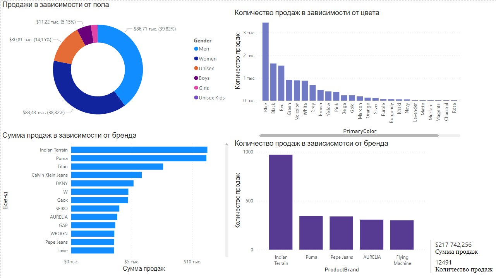
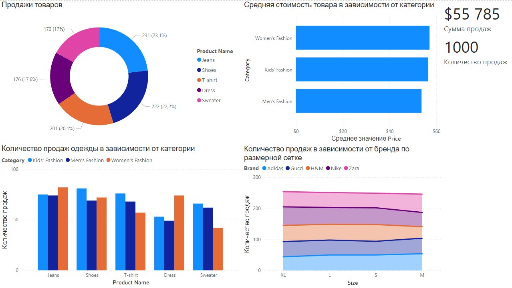

# bi-fashion-dashboards
Дашборды для анализа продаж fashion-товаров на основе открытых датасетов в Power BI.
## Описание проекта

Дашборды предоставляют интуитивно понятное представление данных через графики, диаграммы и визуальные элементы. Это помогает быстро анализировать информацию и выявлять важные тренды, паттерны и аномалии.

---

## 1. Fashion Clothing Products Dashboard

**Используемый датасет:** [Fashion Clothing Products Dataset](https://www.kaggle.com/datasets/shivamb/fashion-clothing-products-catalog/)

- Первая диаграмма позволяет визуализировать зависимость между продажами товаров и полом. Анализируя, какие товары предпочитают покупать разные группы людей в зависимости от пола, компания может лучше понять свою целевую аудиторию и адаптировать свои товары и маркетинговые стратегии для удовлетворения потребностей этих групп.
- Вторая диаграмма позволяет отследить продажи в зависимости от бренда. Анализируя данные о продажах в разрезе брендов, предприятие может оптимизировать свой ассортимент, увеличивая запасы популярных брендов и уменьшая запасы менее востребованных. Это позволяет более эффективно управлять инвентаризацией и снижать издержки на хранение.
- Третья диаграмма отражает количество продаж в зависимости от цвета. Знание о предпочтениях потребителей в отношении цветов товаров позволяет предприятию более точно планировать производство и закупки.
- Четвертая диаграмма отражает количество продаж в зависимости от бренда. Изучение зависимости продаж от бренда помогает компании более точно прогнозировать спрос на товары определенных брендов и, соответственно, управлять запасами. Это помогает избежать излишних запасов и уменьшить риски потери продаж из-за нехватки товара. Также на дашборде мы видим общие сумму продаж и количество продаж.

---

## 2. Fashion Products Dashboard

**Используемый датасет:** [Fashion Products](https://www.kaggle.com/datasets/bhanupratapbiswas/fashion-products/)

- На дашборде представлены общие сумма продаж и количество продаж.
- Первая диаграмма отражает зависимость между продажами товаров и типа вещи. Анализируя данные о продажах в разрезе типов товаров, предприятие может оптимизировать свой ассортимент, увеличивая запасы наиболее популярных типов товаров и сокращая ассортимент менее востребованных.
- Вторая диаграмма позволяет отследить зависимость между количеством продаж и типов вещей, соответствующих разным категориям потребителей. Анализируя данные о продажах по типам вещей и категориям потребителей, предприятие может лучше понять предпочтения и потребности своих клиентов.
- Третья диаграмма позволяет оценить среднюю стоимость товара в зависимости от категории потребителя. Анализ средней стоимости товара для различных категорий потребителей позволяет компании оптимизировать свою ценовую политику.
- Четвертая диаграмма отражает количество продаж в зависимости от бренда по размерной сетке. Понимание того, какой бренд и какие размеры пользуются наибольшим спросом, помогает компании оптимизировать свой ассортимент.

---

## Мой вклад

- Разработка структуры дашбордов.
- Визуализация данных в Power BI (или Tableau/другой BI-системе).
- Анализ и интерпретация результатов.

---

## Данные

Данные взяты из открытых источников:
- [Fashion Clothing Products Catalog](https://www.kaggle.com/datasets/shivamb/fashion-clothing-products-catalog/)
- [Fashion Products](https://www.kaggle.com/datasets/bhanupratapbiswas/fashion-products/)

Для демонстрации используются синтетические примеры.

---

## Как использовать

1. Откройте файл дашборда в Power BI/Tableau.
2. Загрузите пример данных из папки `data/`.
3. Ознакомьтесь с визуализациями и аналитикой.
